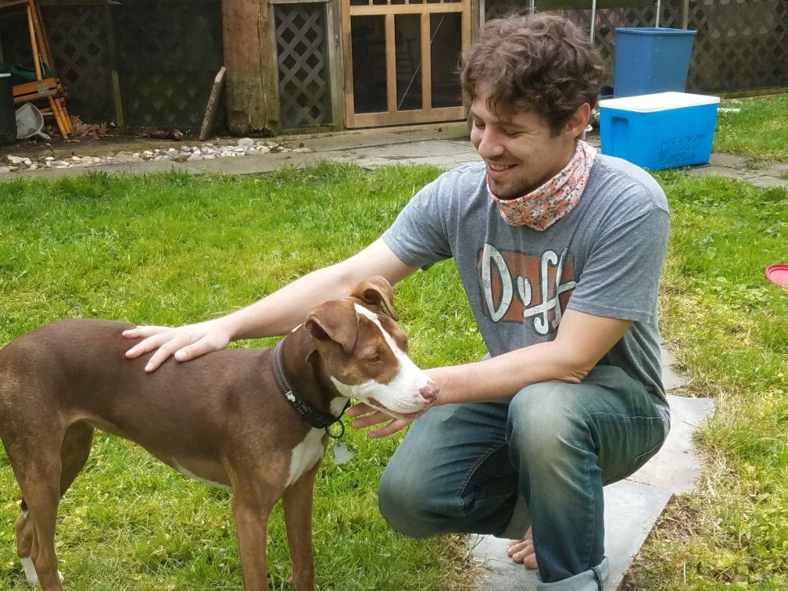

<html>
    <body>
        <header class="text">
            <h1 class="text">Brent Greer</h1>
            <h2 class="text">Full-Stack Web Student at Bloomtech</h2>
        </header>
        

            
        

        

        
I am passionate about building and fixing things, it doesn't really matter what. After 15 years in the automotive industry, I have turned that passion towards programming.

        <ul>My interests include:  
            <li>Movies and TV, mostly sci-fi and comedy</li>
            <li>Solo gaming, survival, city-builders, and I still play Minecraft</li>
            <li>Any and all technology from electric can openers to space ships</li>
        </ul>
        

    </body>
</html>

